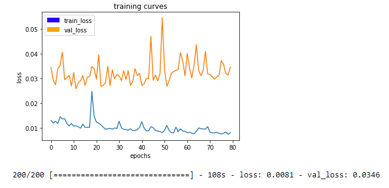

# Project: Deep Learning

---

## Deviations from the setup envoronment steps
A GeForce GTX 1080 graphics card was used instead of AWS. As noted in the research notes, tenserflow was discovered to be using the CPU on the computer instead of the GPU. This also explained why increasing the number of workers did not decrease the time to train the model. As a learning experience to utilize the GPU on my computer, the following modifications were made to the setup instructions.

Install Cuda 8.0 from Nvidia and any additional patches.
[Cuda 9.0](https://developer.nvidia.com/cuda-90-download-archive?)

Along with Nvidia cuDNN 5.1 for Cuda 8.0 (Note need an NVidia Developer account)
[cuDNN](https://developer.nvidia.com/cudnn)

source activate RoboND 
(if the above throws an error, you can run "activate RoboND" instead)

I had already installed tesnsorflow and according to a thread on stack overflow, [Install instructions](https://stackoverflow.com/questions/44829085/tensorflow-not-running-on-gpu) the CPU version needs to be uninstalled.
pip uninstall tensorflow

pip install tensorflow-gpu==1.2.1 (changed from tenerflow==1.2.1
pip install socketIO-client
pip install transforms3d
pip install PyQt5
pip install pyqtgraph


## Required Steps for a Passing Submission:
1. Clone the project repo.
2. Implement a segmentation network in model_training.ipynb.
3. Optimize network and hyper-parameters.
4. Train the network.
5. Continue to experiment with the training data and network until the accuracy is greater than or equal to 40%.
6. All writeup criteria are met by this document.
7. The submitted model is in an .h5  format and will run without errors.
[Rubric](https://review.udacity.com/#!/rubrics/1155/view)
 
---
### FIll Out Model_training.ipnyb

For the first attempt, code from the segmentation lab was added to the model training and any default parameters in the file are used. 

#### Encoder

The encoder function is used to filter the image data by increasing the depth of the image and decreasing the size of the image. This concept was introduced in the convolutional network lesson.

```python
def encoder_block(input_layer, filters, strides):
    
    # TODO Create a separable convolution layer using the separable_conv2d_batchnorm() function.    
    output_layer = separable_conv2d_batchnorm(input_layer, filters, strides)
    
    return output_layer
```
The supplied code snippet was provided by Lesson 32, section 8 and section 9.

#### Decoder

The decoder function will reassemble an image after it has had the 1x1 convolution applied to it. The concatination allows skip connections to be applied to the network and help reassemble the new image.

```python
def decoder_block(small_ip_layer, large_ip_layer, filters):
    
    # TODO Upsample the small input layer using the bilinear_upsample() function.
    upsample_sil = bilinear_upsample(small_ip_layer)
    
    # TODO Concatenate the upsampled and large input layers using layers.concatenate
    output = layers.concatenate([upsample_sil, large_ip_layer])
    
    # TODO Add some number of separable convolution layers
    output_layer = separable_conv2d_batchnorm(output, filters)
    
    return output_layer
```

Lessson 32 sections 9 and 10 contained the code needed for the decoder. At the TODO with "Add some number", it is set to a single layer to keep the number of decoder layers equal to the number of encoder layers. If there are still some challenges after apllying more filters, this last todo should be tested with more separable convolution layers.

#### Fully Convolutional Network Model

##### First Run
The initial step was to test out an FCN with only 1 encoder and decoder layer each. This was to establish a baseline on how additional layers will affect the results of the FCN. The 1 by 1 convolution is added after the encoders and before the decoders to create a fully convolutional network. This will allow the software to determine where in the image the hero is so the drone can navigate to the correct location.


```ptyhon
def fcn_model(inputs, num_classes):
    
    # TODO Add Encoder Blocks. 
    # Remember that with each encoder layer, the depth of your model (the number of filters) increases.
    x_encoded1 = encoder_block(inputs, 64, 2)

    # TODO Add 1x1 Convolution layer using conv2d_batchnorm().
    x_conv = conv2d_batchnorm(x_encoded1, 158)
    
    # TODO: Add the same number of Decoder Blocks as the number of Encoder Blocks
    x = decoder_block(x_conv, inputs, 64)    
    
    # The function returns the output layer of your model. "x" is the final layer obtained from the last decoder_block()
    return layers.Conv2D(num_classes, 1, activation='softmax', padding='same')(x)
```

##### Second Run
As mentioned in Lesson 30 Section 5, more layers will be able to pick up additional details and more complex ideas. Following this lesson, it was decided to move on to 3 layers. Section 16 mentions that a The downside is that more layers will increased the amount of time per epoch to train the model.0 

##### Passing Run


The FCN that gained a score of 41% had only 2 filters per encoder and decoder. Thiy type of FCN will only detect general shapes and it appeard that adding more would result in too much detail being pulled from the images. 

### Optimize Network and Parameters

##### First Run

For the initial test, the default parameters from previous labs were used as a baseline.
```python
learning_rate = 0.1
batch_size = 64
num_epochs = 1
steps_per_epoch = 200
validation_steps = 50
workers = 2
```

##### Second Run
Since the first training run took about 3 hours, the first parameter to improve was the number of workers. Brute force was utilized to determine the value, starting at 9657 seconds per epoch with two workers and then increasing the number of workers by 1 until the time per epoch began increasing again. It was quickly discovered that 2 was the fastest number with 10085 seconds at 1 worker and 9952 with 3 workers. After getting the GPU to be utilized, 5 workers decreased the runtime to about 80 seconds per epoch. 

The learning rate of 0.1 was a typo and corrected to a lower rate as Lesson 28 specified that a lower learning rate will achieve a better accuracy. 

Larger batch sizes are crashing, so for now keeping at 32. 

Lesson 28 also indicated that with a learning rate of 0.1 and batch 128, only 80 epochs were needed to improve the accuracy. The starting number is estimated as 20 and the loss will be used to determine if the number is too low or high. 

The reccomended calculation were made for the steps. 

1,184 images in validation and 4,131 images are in the training data folder and the numbers were divided by the batch size and rounded up.

```python
learning_rate = 0.01
batch_size = 32
num_epochs = 100
steps_per_epoch = 128
validation_steps = 37
workers = 5
```

##### Passing Run

```python
learning_rate = 0.01
batch_size = 32
num_epochs = 80
steps_per_epoch = 200
validation_steps = 100
workers = 5
```

The parameter adjustments followed some logical testing, but the suggested calculations did not result in a acore above 40, the actual values of the parameters were guesses. It was understood that increasing the steps would increase the numbers of images used for training and validation in a singe epoch. It was also understood that teh batch size would import more images with each epoch, but it tended to result in crashing with a lack of memory error. The number of epochs will be less with a smaller learning rate, and too large of a number will result in overfitting. Too small of a number will result in inaccurate results.


### Training the Network

##### First Run
With the initial architecture of one encoder, one decoder, and the default parameters the final score was about 10%. The predictions showed that the full image of the hero was not detected and additional people were also not detected as well.


Since additional details were missing, additional filters should be applied to the image.

##### Second Run
After taking down the kernel with the latest parameters, it was discovered that python was not utilizing the GPU. After getting the GPU tenserflow working, the latest setup resulted in no objects recognized. It is realized that this is because a small number of images are being processed at a time and the epoch number is small.

After getting the GPU up and running, the final score with 3 filters and the new parameters was 37%.


The prediction was correct when following the hero, but it missed when the hero was at a distance. It was also noticed that the smaller images did not have the proper resolution. 


There was some uncertanty on if this was the training data or the number of filters. The first thought was to try adding another filter to verify if training or filters will improve the prediction resolution. The suspicion is more filters since the training curve became worse after about 50 epochs.


##### Passing Run
See last paragraph of "Additional Testing and Tuning".


### Additional Testing and Tuning
A 4th filter was added and resulted in a score of 38%
2 Filters resulted in a score of 39%
Suspicion that the spike close to 60  in the previous predicitons may be a result of overfitting, so the number of epochs was scaled down to 50 and the number of steps per epoch was returned to the default to see if increasing the batches would improve the accuracy.


The resulting score of 41% still had trouble spotting the hero at a distance, but this may improve with the 4 filters.


Increasing the number of filters to 4 filters actually decreased the score to 38%, so the number of filters was scaled back to 3. Since increasing the steps per epoch had improved the score and the validation loss was volatile, the number of validation steps was increased to 100 to test if this was also part of the problem. (Since the number of epochs is decreased to reduce the chance of overfitting, the number of images used per epoch should also be increased to train and validate on larger sample sizes)

This ended up increasing the score to 29%. The next step was to attempt to try bumping the score higher than 41%, so it was returned to 2 filters and the number of epoch was increased to 80. This brought the score back up to 41. The hero was recognized both at a distance and when directly followed.




The downside to this setup was that there were partial false positives and inanimate objects were kept in the final image.


### Future Enhancements
To have the network detect objects other than humans, it would need to be trained with datasets that contain and validate for the new object to be detected. 

Since additional filters decreased the score, the number of filters will be kept at 2 and the tuning parameters should continue to be improved. The notation made in the decoder should also be looked into since the images have some partial false positives and will show inanimate objects as well when decoding.

